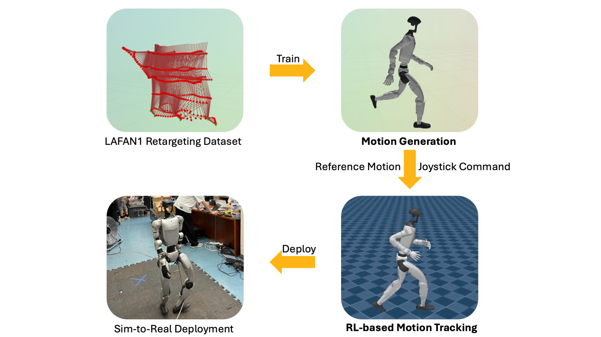

# Generating Human Priors for Mimic Control

Keywords: Humanoid Locomotion, Motion Generation, Motion Tracking, Reinforcement Learning, Sim-to-Real

## Project Overview

This project presents a two-stage pipeline for generating **natural, human-like** locomotion with **real-time joystick control** for the **Unitree G1 humanoid robot**. 

Stage 1 uses a command-conditioned **Motion Generation** model from human motion capture (**Mocap**) data, producing natural robot trajectories from future joystick commands. 

Stage 2 uses **RL-based Motion Tracking** to convert those generated trajectories into dynamically feasible motor control, while eliminating the artifact produced by previous stage. 

<p align="center">
  
  <br>
  <em>Overview of the project pipeline.</em>
</p>

The pipeline bridges the gap between Mocap data and dynamically feasible **real-time**, **joystick-based** control.


<p align="center">
  
  <br>
  <em>Proposed RL policy compared with velocity-tracking policy in Mujoco.</em>
</p>

## Stage 1: Motion Generation

<p align="center">
  
  <br>
  <em>Motion generation: real-time joystick-conditioned trajectory prediction.</em>
</p>

This **autoregressive** generative model can predict robot trajectories with natural transitions conditioned on future joystick commands over a **long horizon**. The first stage serves as a **data engine** to obtain the robot's response to joystick command labels.
- **Dataset**: Uses the **[LAFAN1 Retargeting Dataset](https://huggingface.co/datasets/lvhaidong/LAFAN1_Retargeting_Dataset)** for training. The data is specifically retargeted to the G1 humanoid's joint limits and link proportions.
- **Motion Representation**:
  - 36-dimensional state representation $S_t$:
    - Robot base velocity and orientation `(7)`
    - Joint angles `(29)`
  - 3-dimensional joystick command $V_t$, extracted and filtered from original motion data.
    - $V_t = [v_x, v_y, v_\omega]$
- **Model Architecture**: A lightweight, kinematics-only, GRU (Gated Recurrent Unit)-based **sequence prediction** model that encodes past states and predicts future states conditioned on future joystick commands.

$$S_{t:t+20} = f(S_{t-10:t}, V_{t:t+20})$$

- **Real-Time Inference and Visualization**: Capable of processing joystick inputs instantly to generate responsive motion in real time with low latency. Integrated with the **[Rerun SDK](https://rerun.io/)** for real-time visualization of the robot's trajectory.

## Stage 2: Motion Tracking (Code Coming Soon)

Kinematic trajectories alone are insufficient for real-robot deployment. To obtain **dynamically feasible** behavior under complex physical interactions, we use RL-based motion tracking to translate generated trajectories into executable motor control.

We use 10-minute Stage 1-generated robot trajectories at 30 Hz, together with joystick command labels, as reference motion for the second stage.

The second stage follows the **[BeyondMimic Motion Tracking](https://github.com/HybridRobotics/whole_body_tracking/tree/main)** framework with modified observations. The original observation is:

$$O_t=[\psi, e_{anchor}, \nu_{imu}, \theta-\theta_0, \dot{\theta}, a_{last}]$$

- **Reference-free**: Since we're not strictly following the generated motion, the reference motion $\psi$ and anchor error $e_{anchor}$ are no longer needed.
- **Joystick input**: Instead, the policy should respond to joystick command $V_t$.
- **Temporal information**: Removing the reference motion can lead to insufficient information in the motion tracking task, so we augment the policy observation with **history**. Each term in the single-frame observation is stacked over a history window of H frames.

The final observation is:

$$o_t=[V_{t}, \nu_{imu}, \theta-\theta_0, \dot{\theta}, a_{last}]$$
$$O_t = [o_{t-H+1}, \dots, o_t]$$

## Code Structure
- `model/dataset.py`: Dataset loader and normalization utilities.
- `model/inference_rt.py`: Real-time autoregressive inference with joystick input and visualization.
- `model/joystick.py`: Joystick input interface.
- `model/models.py`: Motion generation model definitions.
- `model/rerun_visualize.py`: Rerun-based robot visualization utilities.
- `model/train.py`: Training entry point for the motion generator.

## Dataset Preparation

```text
dataset/
├── data_joint/
│   ├── walk/
│   └── run/
├── data_feature/
│   ├── walk/
│   └── run/
├── data_label/
│   ├── walk/
│   └── run/
├── g1_retargeted_dataset/
└── extract_features_labels.py
```

Each folder under `data_*` is organized by motion type, such as `walk/` and `run/`.

1. Download the **[LAFAN1 Retargeting Dataset](https://huggingface.co/datasets/lvhaidong/LAFAN1_Retargeting_Dataset)** to `dataset/g1_retargeted_dataset/`.
2. Manually clip locomotion segments from `dataset/g1_retargeted_dataset/` into `dataset/data_joint/` under the appropriate motion type subfolder (e.g., `walk/`, `run/`).
3. Run `dataset/extract_features_labels.py` to extract the motion representation into `dataset/data_feature/` and the joystick command labels into `dataset/data_label/`.

```bash
python dataset/extract_features_labels.py
```

## Usage

```bash
git clone https://github.com/hanqing-shi/Humanoids-Motion-Generation.git
cd Humanoids-Motion-Generation
```

Install [uv](https://docs.astral.sh/uv/):

```bash
curl -LsSf https://astral.sh/uv/install.sh | sh
```

All scripts are run from the repository root using `uv run`, which automatically installs dependencies on first use.

### Training

```bash
uv run python model/train.py --config config.yaml
```

### Real-Time Inference

Requires a connected joystick and the [Rerun SDK](https://rerun.io/) for visualization.

```bash
uv run python model/inference_rt.py --config config.yaml
```

The Rerun viewer will open automatically. Use the joystick to command the robot in real time.

## References

[1] A. Martinez, M. Black, and J. Romero, "On Human Motion Prediction Using Recurrent Neural Networks," in *Proceedings of the IEEE Conference on Computer Vision and Pattern Recognition (CVPR)*, 2017.

[2] H. Y. Ling, F. Zinno, G. Cheng, and M. Van de Panne, "Character Controllers Using Motion VAEs," *ACM Transactions on Graphics*, vol. 39, no. 4, Art. 40, Aug. 2020, 12 pages.

[3] Q. Liao et al., "BeyondMimic: From Motion Tracking to Versatile Humanoid Control via Guided Diffusion," 2024.

[4] J. Harvey et al., "LAFAN1: A High-Quality Motion Capture Dataset for Animation Research," 2020.
